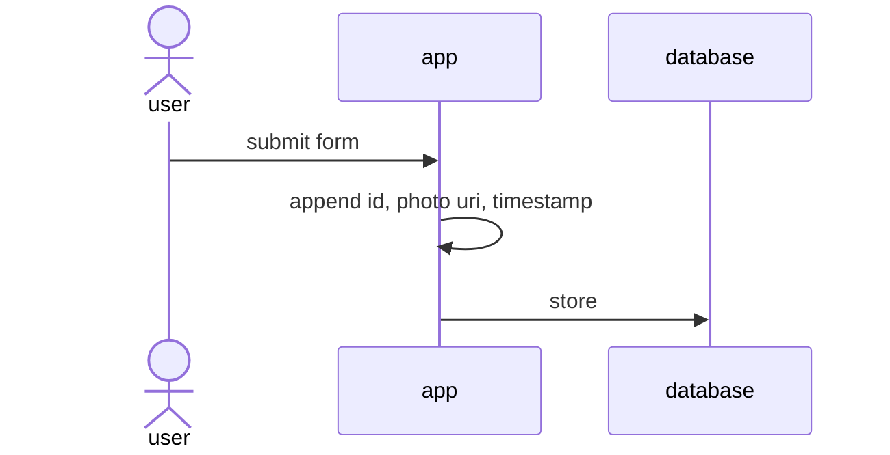

# Trackside

Trackside is a local-first trainspotting journal for UK rail enthusiasts, built
with React Native, Expo, and TypeScript.

### Mission

Trackside is an app for trainspotters, by trainspotters. Use of the app should be natural and fast,
to accomodate the "in the moment" nature of trainspotting.

## MVP

- Log a 4–6 digit TOPS number, with its class derived automatically.
- Optionally add a location, destination, and photo from the camera or library.
- Browse and remove recent sightings, with basic local collection stats.
- Store sightings in an on-device SQLite database; photos are copied into the
  app's local document storage.
- Run `npm run typecheck` to type-check the app.

No account, location permission, or network connection is needed. Following
other spotters and sharing or liking sightings are future features; nothing in
this MVP is uploaded or shared.

## Tests

```sh
npm test
npm run test:coverage
npm run typecheck
```

The Jest suites use Jest Expo and React Native Testing Library. Native image,
filesystem, alert, and database-context APIs are mocked at the component-test
boundary; SQLite wrapper unit tests separately verify SQL and bound values.
Coverage thresholds are enforced at 100% for statements, branches, functions,
and lines.

The real SQLite integration suite runs in the app on a device or simulator
against an isolated `:memory:` database. Build and launch the integration
screen, then run its Maestro flow:

```sh
EXPO_PUBLIC_SQLITE_INTEGRATION=1 npx expo run:android
maestro test maestro/sqlite-integration.yaml
```

Use `npx expo run:ios` on macOS for iOS. For the normal app persistence journey,
run the app without the integration flag and execute:

```sh
npx expo run:android
maestro test maestro/local-journal-e2e.yaml
```

## Architecture

The user interacts with the app purely locally, to allow the fast interactions required, regardless of internet connectivity. This interaction consists of reads and writes to the local SQLite database.

